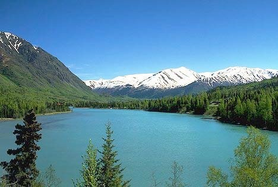
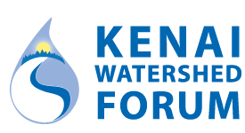

# Preface {.unnumbered}

This document is the online version of the Water Quality Assessment of the Kenai River Watershed, 2000 - 2023. It is an update to historical reports  summarising available data to date for this project [@mccard2007; @guerronorejuela2016].

The report can also be downloaded as an Microsoft Word document by clicking on the 'W' symbol in the upper left corner. All project files and source code are hosted in a public GitHub repository, which is accessible by clicking the GitHub symbol in the upper left corner.

<br>

```{r echo = F}
library(knitr)


```

```{r echo = F}

```

\newpage
