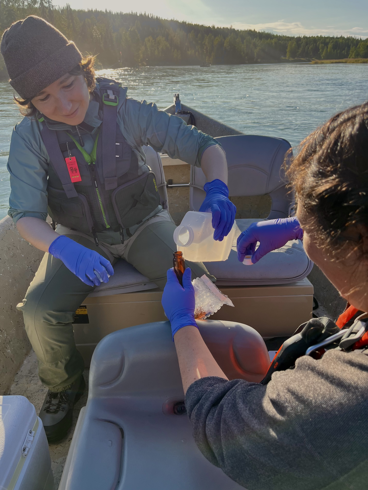
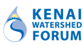

```{r report-year}
# Define report_year early so inline R expressions in headings and cover chunks can use it.
# The full setup chunk (paths, data loading) runs later in the document.
report_year <- 2025
```

```{r libraries}
# Load packages here so they are available to all subsequent chunks and inline R
# expressions, including those that appear before the main setup chunk.
library(tidyverse)
library(readxl)
library(flextable)
library(officer)
```

::: {.content-visible when-format="html"}
# Kenai River Baseline Water Quality Monitoring: `r report_year` Field Season Summary

**PRELIMINARY** - Results subject to change pending QA/QC review and EPA WQX submission.

*Kenai Watershed Forum \| 44129 Sterling Highway, Soldotna, AK 99669 \| www.kenaiwatershed.org*

*Benjamin Meyer, Research Coordinator \| (907) 260-5449 \| hydrology\@kenaiwatershed.org*

*`r format(Sys.Date(), "%B %Y")`*

```{r fieldwork-image}
#| fig-align: center
#| out-width: "50%"
#| fig-cap: "*Alaska Department of Environmental Conservation staff collect water samples on the middle Kenai River in 2025.*"


```

------------------------------------------------------------------------
:::

```{=openxml}
<w:p><w:pPr><w:jc w:val="center"/><w:spacing w:before="1440" w:after="0"/></w:pPr></w:p>
```
::: {.content-visible when-format="docx"}
```{r cover-logo}
#| fig-align: center
#| out-width: "2in"

```
:::

```{=openxml}
<w:p><w:pPr><w:jc w:val="center"/><w:spacing w:before="240" w:after="0"/></w:pPr></w:p>

<w:p>
  <w:pPr><w:jc w:val="center"/><w:spacing w:before="0" w:after="120"/></w:pPr>
  <w:r><w:rPr><w:b/><w:sz w:val="52"/><w:szCs w:val="52"/></w:rPr>
    <w:t>Kenai River Baseline Water Quality Monitoring</w:t></w:r>
</w:p>
```
```{r docx-subtitle}
#| output: asis
#| eval: !expr knitr::is_html_output()
cat(paste0(
  "```{=openxml}\n",
  "<w:p>\n",
  "  <w:pPr><w:jc w:val=\"center\"/><w:spacing w:before=\"0\" w:after=\"360\"/></w:pPr>\n",
  "  <w:r><w:rPr><w:b/><w:sz w:val=\"40\"/><w:szCs w:val=\"40\"/></w:rPr>\n",
  "    <w:t>", report_year, " Field Season Summary</w:t></w:r>\n",
  "</w:p>\n",
  "```\n"
))
```

```{=openxml}
<w:p>
  <w:pPr>
    <w:jc w:val="center"/>
    <w:spacing w:before="0" w:after="360"/>
    <w:pBdr><w:bottom w:val="single" w:sz="6" w:space="1" w:color="auto"/></w:pBdr>
  </w:pPr>
</w:p>

<w:p>
  <w:pPr><w:jc w:val="center"/><w:spacing w:before="240" w:after="80"/></w:pPr>
  <w:r><w:rPr><w:b/><w:i/><w:sz w:val="24"/><w:szCs w:val="24"/><w:color w:val="C0392B"/></w:rPr>
    <w:t>PRELIMINARY</w:t></w:r>
</w:p>
<w:p>
  <w:pPr><w:jc w:val="center"/><w:spacing w:before="0" w:after="0"/></w:pPr>
  <w:r><w:rPr><w:i/><w:sz w:val="20"/><w:szCs w:val="20"/><w:color w:val="C0392B"/></w:rPr>
    <w:t>Results subject to change pending QA/QC review and EPA WQX submission</w:t></w:r>
</w:p>

<w:p><w:pPr><w:spacing w:before="2160" w:after="0"/></w:pPr></w:p>

<w:p>
  <w:pPr><w:jc w:val="center"/><w:spacing w:before="0" w:after="80"/></w:pPr>
  <w:r><w:rPr><w:sz w:val="22"/><w:szCs w:val="22"/></w:rPr>
    <w:t>Prepared by:</w:t></w:r>
</w:p>
<w:p>
  <w:pPr><w:jc w:val="center"/><w:spacing w:before="0" w:after="80"/></w:pPr>
  <w:r><w:rPr><w:b/><w:sz w:val="24"/><w:szCs w:val="24"/></w:rPr>
    <w:t>Kenai Watershed Forum</w:t></w:r>
</w:p>
<w:p>
  <w:pPr><w:jc w:val="center"/><w:spacing w:before="0" w:after="60"/></w:pPr>
  <w:r><w:rPr><w:sz w:val="20"/><w:szCs w:val="20"/></w:rPr>
    <w:t>44129 Sterling Highway, Soldotna, AK 99669</w:t></w:r>
</w:p>
<w:p>
  <w:pPr><w:jc w:val="center"/><w:spacing w:before="0" w:after="60"/></w:pPr>
  <w:r><w:rPr><w:sz w:val="20"/><w:szCs w:val="20"/></w:rPr>
    <w:t>www.kenaiwatershed.org</w:t></w:r>
</w:p>
<w:p>
  <w:pPr><w:jc w:val="center"/><w:spacing w:before="120" w:after="0"/></w:pPr>
  <w:r><w:rPr><w:sz w:val="20"/><w:szCs w:val="20"/></w:rPr>
    <w:t>Benjamin Meyer, Research Coordinator</w:t></w:r>
</w:p>
<w:p>
  <w:pPr><w:jc w:val="center"/><w:spacing w:before="0" w:after="0"/></w:pPr>
  <w:r><w:rPr><w:sz w:val="20"/><w:szCs w:val="20"/></w:rPr>
    <w:t>Phone: (907) 260-5449</w:t></w:r>
</w:p>
<w:p>
  <w:pPr><w:jc w:val="center"/><w:spacing w:before="0" w:after="60"/></w:pPr>
  <w:r><w:rPr><w:sz w:val="20"/><w:szCs w:val="20"/></w:rPr>
    <w:t>hydrology@kenaiwatershed.org</w:t></w:r>
</w:p>
```
```{r docx-cover-date}
#| output: asis
#| eval: !expr knitr::is_html_output()
cat(paste0(
  "```{=openxml}\n",
  "<w:p>\n",
  "  <w:pPr><w:jc w:val=\"center\"/><w:spacing w:before=\"120\" w:after=\"0\"/></w:pPr>\n",
  "  <w:r><w:rPr><w:sz w:val=\"22\"/><w:szCs w:val=\"22\"/></w:rPr>\n",
  "    <w:t>", format(Sys.Date(), "%B %Y"), "</w:t></w:r>\n",
  "</w:p>\n",
  "```\n"
))
```

```{=openxml}
<w:p><w:r><w:br w:type="page"/></w:r></w:p>

<w:p>
  <w:pPr><w:pStyle w:val="Heading1"/><w:spacing w:before="0" w:after="240"/></w:pPr>
  <w:r><w:t>Contents</w:t></w:r>
</w:p>
<w:p>
  <w:r><w:rPr><w:noProof/></w:rPr>
    <w:fldChar w:fldCharType="begin" w:dirty="true"/>
  </w:r>
  <w:r>
    <w:instrText xml:space="preserve"> TOC \o "1-2" \h \z \u </w:instrText>
  </w:r>
  <w:r><w:fldChar w:fldCharType="separate"/></w:r>
  <w:r><w:fldChar w:fldCharType="end"/></w:r>
</w:p>

<w:p>
  <w:pPr><w:spacing w:before="480" w:after="0"/></w:pPr>
  <w:r><w:rPr><w:i/><w:sz w:val="16"/><w:szCs w:val="16"/></w:rPr>
    <w:t xml:space="preserve">AI disclosure: This document was drafted with assistance from Posit Assistant, an AI tool developed by Posit PBC. Posit Assistant was used to help write data processing code, interpret preliminary results, and draft text. All analytical decisions, data quality judgments, and factual content were reviewed and approved by KWF staff. The preliminary findings and regulatory comparisons in this document reflect KWF&#x2019;s own evaluation of preliminary data.</w:t>
  </w:r>
</w:p>

<w:p><w:r><w:br w:type="page"/></w:r></w:p>
```
::: {.content-visible when-format="docx"}
```{r fieldwork-image-docx}
#| fig-align: center
#| out-width: "50%"
#| fig-cap: "*Alaska Department of Environmental Conservation staff collect water samples on the middle Kenai River in 2025.*"

```
:::

```{r setup}
# ---- Input file paths (update for each year) --------------------------------
# SGS files follow a consistent naming convention built from report_year:
sgs_base        <- file.path("../../input", paste0(report_year, "_data"))
spring_sgs_path <- file.path(sgs_base, paste0("spring_", report_year), "SGS",
                              paste0("spring_", report_year, "_kenai_baseline_sgs_results.xlsx"))
summer_sgs_path <- file.path(sgs_base, paste0("summer_", report_year), "SGS",
                              paste0("summer_", report_year, "_kenai_baseline_results_sgs.xlsx"))
# SWWTP filenames include the specific sampling date (MM-DD-YY); update each year:
spring_swwtp_path <- file.path(sgs_base, paste0("spring_", report_year), "SWWTP",
                                "KRWF TSS MONITORING 05-01-25.xlsx")
summer_swwtp_path <- file.path(sgs_base, paste0("summer_", report_year), "SWWTP",
                                "KRWF TSS MONITORING 07-25-25.xls")
# FC filenames include the specific sampling date (MM-DD-YY); update each year:
spring_fc_path    <- file.path(sgs_base, paste0("spring_", report_year), "SWWTP",
                                "KRWF Fecal 04-30-25.xls")
summer_fc_path    <- file.path(sgs_base, paste0("summer_", report_year), "SWWTP",
                                "KRWF Fecal 07-23-25.xls")
# YSI field meter data (single combined file covering both seasons):
ysi_path          <- file.path(sgs_base,
                                paste0(report_year,
                                       " Kenai Agency Baseline YSI ProQuatro and Turbidity Data.xlsx"))

# ---- Consistent table style -------------------------------------------------
fmt_table <- function(df, col_widths = NULL, fontsize = 9) {
  ft <- flextable(df) |>
    theme_vanilla() |>
    border_outer(border = fp_border(color = "black", width = 1.5)) |>
    border_inner_h(border = fp_border(color = "black", width = 0.5)) |>
    border_inner_v(border = fp_border(color = "black", width = 0.5)) |>
    bold(part = "header") |>
    fontsize(size = fontsize, part = "all") |>
    padding(padding = 3, part = "all") |>
    align(align = "left", part = "all")
  if (!is.null(col_widths)) {
    ft <- ft |> width(j = seq_along(col_widths), width = col_widths)
  } else {
    ft <- ft |> autofit()
  }
  # Keep table rows together (prevents splitting across pages in DOCX)
  if (nrow(df) > 1) {
    ft <- ft |> keep_with_next(i = seq_len(nrow(df) - 1), value = TRUE)
  }
  ft
}

# ---- Load raw SGS data ------------------------------------------------------
is_primary <- function(x) {
  !str_detect(str_to_lower(x), "blank|blk|dup|field b|qc")
}

spring_sgs_raw <- read_excel(spring_sgs_path, sheet = "Sheet8") |>
  mutate(season = "Spring")

summer_sgs_raw <- read_excel(summer_sgs_path, sheet = "Sheet8") |>
  mutate(season = "Summer")

all_sgs_raw <- bind_rows(spring_sgs_raw, summer_sgs_raw)

# ---- Unit correction (Ca/Fe/Mg reported as ug/L but on mg/L scale) ----------
unit_correct <- function(df) {
  df |> mutate(
    RESULT = if_else(
      ANALYTE %in% c("Calcium", "Iron", "Magnesium") & UNITS == "ug/L",
      RESULT / 1000, RESULT
    ),
    UNITS = if_else(
      ANALYTE %in% c("Calcium", "Iron", "Magnesium") & UNITS == "ug/L",
      "mg/L", UNITS
    )
  )
}

# ---- Primary samples --------------------------------------------------------
sgs <- all_sgs_raw |>
  filter(SAMPLE_TYPE == "PS", is_primary(SAMPLE_ID),
         !str_detect(ANALYTE, "surr|surrogate")) |>
  # Take the lowest available analytical cut per sample/analyte (cut 1 for metals,
  # cut 2 for nitrate/nitrite which SGS reports only as cut 2)
  group_by(season, SAMPLE_ID, ANALYTE, DISSOLVED) |>
  filter(ANALYTICAL_CUT == min(ANALYTICAL_CUT)) |>
  ungroup() |>
  unit_correct() |>
  mutate(
    fraction = case_when(
      DISSOLVED == "L" ~ "Dissolved",
      ANALYTE %in% c("Calcium", "Iron", "Magnesium") ~ "Total",
      ANALYTE %in% c("Total Nitrate/Nitrite-N", "Total Phosphorus") ~ "Total",
      str_detect(ANALYTE, "Benzene|Toluene|Xylene|Ethyl") ~ "Volatile",
      TRUE ~ "Total"
    )
  )

# ---- Metadata ---------------------------------------------------------------
n_spring_sites <- sgs |> filter(season == "Spring") |> pull(SAMPLE_ID) |> n_distinct()
n_summer_sites <- sgs |> filter(season == "Summer") |> pull(SAMPLE_ID) |> n_distinct()
spring_date <- format(
  as.Date(min(sgs$COLLECT_DATE[sgs$season == "Spring"], na.rm = TRUE), "%m/%d/%Y %H:%M"),
  "%B %d, %Y"
)
summer_date <- format(
  as.Date(min(sgs$COLLECT_DATE[sgs$season == "Summer"], na.rm = TRUE), "%m/%d/%Y %H:%M"),
  "%B %d, %Y"
)

# ---- Parameter labels / groups ----------------------------------------------
param_labels <- c(
  "Arsenic" = "Arsenic", "Cadmium" = "Cadmium", "Chromium" = "Chromium",
  "Copper" = "Copper", "Lead" = "Lead", "Zinc" = "Zinc",
  "Calcium" = "Calcium", "Iron" = "Iron", "Magnesium" = "Magnesium",
  "Total Nitrate/Nitrite-N" = "Nitrate + Nitrite (as N)",
  "Total Phosphorus" = "Total Phosphorus",
  "Benzene" = "Benzene", "Toluene" = "Toluene",
  "Ethylbenzene" = "Ethylbenzene", "o-Xylene" = "o-Xylene",
  "P & M -Xylene" = "p/m-Xylene", "Xylenes (total)" = "Total Xylenes",
  "Total Suspended Solids" = "Total Suspended Solids",
  "Fecal Coliform" = "Fecal Coliform",
  "Water Temperature"    = "Water Temperature",
  "Specific Conductance" = "Specific Conductance",
  "Dissolved Oxygen"     = "Dissolved Oxygen",
  "Turbidity"            = "Turbidity",
  "pH"                   = "pH"
)
param_groups <- c(
  "Arsenic" = "Dissolved metals", "Cadmium" = "Dissolved metals",
  "Chromium" = "Dissolved metals", "Copper" = "Metals",
  "Lead" = "Dissolved metals", "Zinc" = "Metals",
  "Calcium" = "Total metals", "Iron" = "Total metals", "Magnesium" = "Total metals",
  "Total Nitrate/Nitrite-N" = "Nutrients", "Total Phosphorus" = "Nutrients",
  "Benzene" = "Hydrocarbons (BTEX)", "Toluene" = "Hydrocarbons (BTEX)",
  "Ethylbenzene" = "Hydrocarbons (BTEX)", "o-Xylene" = "Hydrocarbons (BTEX)",
  "P & M -Xylene" = "Hydrocarbons (BTEX)", "Xylenes (total)" = "Hydrocarbons (BTEX)",
  "Total Suspended Solids" = "Field parameters",
  "Fecal Coliform"         = "Field parameters",
  "Water Temperature"      = "Field parameters",
  "Specific Conductance"   = "Field parameters",
  "Dissolved Oxygen"       = "Field parameters",
  "Turbidity"              = "Field parameters",
  "pH"                     = "Field parameters"
)
group_order <- c("Dissolved metals", "Metals", "Total metals",
                 "Nutrients", "Hydrocarbons (BTEX)", "Field parameters")

# ---- Load SWWTP TSS data ----------------------------------------------------
# Both spring and summer files have an "Updated_Formatting" tab with tidy columnar data.
# Spring: KRWF TSS MONITORING 05-01-25.xlsx (Updated_Formatting created from Sheet1)
# Summer: KRWF TSS MONITORING 07-25-25.xls  (Updated_Formatting, skip = 1 for title row)
spring_swwtp_raw <- read_excel(spring_swwtp_path, sheet = "Updated_Formatting") |>
  filter(sample_type == "PS") |>
  transmute(
    season    = "Spring",
    SAMPLE_ID = str_replace(Sample_Location, "(?i)^RM_", "RM ") |>
                str_replace("(?i)^RM\\s*O$", "RM 0") |>
                str_squish(),
    RESULT    = `S.S.mg/L`
  )

summer_swwtp_raw <- read_excel(summer_swwtp_path, sheet = "Updated_Formatting", skip = 1) |>
  filter(sample_type == "PS") |>
  transmute(
    season    = "Summer",
    SAMPLE_ID = str_replace(Sample_Location, "(?i)^RM_", "RM ") |>
                str_replace("(?i)^RM\\s*O$", "RM 0") |>
                str_squish(),
    RESULT    = `S.S.mg/L`
  )

# Primary TSS results (no duplicates)
norm_tss <- function(df) {
  df |>
    filter(!str_detect(str_to_lower(SAMPLE_ID), "dup")) |>
    mutate(ANALYTE = "Total Suspended Solids", UNITS = "mg/L", fraction = "Suspended",
           RESULTFLAG = if_else(is.na(RESULT) | RESULT == 0, "U", "="))
}

swwtp_tss <- bind_rows(norm_tss(spring_swwtp_raw), norm_tss(summer_swwtp_raw))

# TSS field duplicates for RPD (Table 8)
spring_tss_dups <- spring_swwtp_raw |>
  filter(str_detect(str_to_lower(SAMPLE_ID), "dup")) |>
  mutate(primary_id = str_replace(SAMPLE_ID, "(?i)\\s*dup.*$", "") |> str_squish(),
         RESULTFLAG = if_else(is.na(RESULT) | RESULT == 0, "U", "="))

summer_tss_dups <- read_excel(summer_swwtp_path, sheet = "Updated_Formatting", skip = 1) |>
  filter(sample_type == "PS", str_detect(str_to_lower(Sample_Location), "dup")) |>
  transmute(
    season     = "Summer",
    primary_id = str_replace(Sample_Location, "(?i)_?dup.*$", "") |>
                 str_replace("(?i)^RM_", "RM ") |>
                 str_squish(),
    RESULT     = `S.S.mg/L`,
    RESULTFLAG = if_else(is.na(`S.S.mg/L`) | `S.S.mg/L` == 0, "U", "=")
  )

swwtp_tss_dups <- bind_rows(spring_tss_dups, summer_tss_dups)

# ---- Load SWWTP FC data -----------------------------------------------------
# skip = 10 skips the lab metadata header; row 11 of the file becomes column names.
# "Colony Count/100mL" is the pre-computed CFU/100mL result.
# Exclude blanks, positive controls, field duplicates, and sites marked N/A.
parse_fc <- function(path, season_name) {
  read_excel(path, skip = 10) |>
    rename(SAMPLE_ID    = `Sample Location/RM`,
           result_100ml = `Colony Count/100mL`) |>
    filter(
      !is.na(SAMPLE_ID),
      !str_detect(str_to_lower(SAMPLE_ID), "^blank$|positive|dish number"),
      !str_detect(str_to_lower(SAMPLE_ID), "dup"),
      ML != "N/A", !is.na(ML)
    ) |>
    mutate(
      season     = season_name,
      RESULT     = as.numeric(result_100ml),
      RESULTFLAG = if_else(is.na(RESULT) | RESULT == 0, "U", "="),
      ANALYTE    = "Fecal Coliform",
      UNITS      = "CFU/100mL",
      fraction   = "None",
      REPDL      = NA_real_
    ) |>
    filter(!is.na(RESULT)) |>
    select(season, SAMPLE_ID, ANALYTE, UNITS, fraction, RESULT, RESULTFLAG, REPDL)
}

swwtp_fc <- bind_rows(
  parse_fc(spring_fc_path, "Spring"),
  parse_fc(summer_fc_path, "Summer")
)

# ---- Load YSI field meter data -----------------------------------------------
# Single file covers both seasons. Season assigned from collection month.
# Each site has 2 replicate observations; primary observations are averaged
# across replicates to produce one value per site-season-parameter.
# DUP sites (e.g. "Swiftwater Park-DUP") are held separately for RPD computation.
ysi_param_map <- c(
  "Temperature"  = "Water Temperature",
  "Conductivity" = "Specific Conductance",
  "DO"           = "Dissolved Oxygen",
  "Turbidity"    = "Turbidity",
  "pH"           = "pH"
)
ysi_unit_map <- c(
  "Water Temperature"    = "deg C",
  "Specific Conductance" = "uS/cm",
  "Dissolved Oxygen"     = "mg/L",
  "Turbidity"            = "NTU",
  "pH"                   = "s.u."
)

# Read once; shared between primary and DUP computations.
# Exclude physically impossible values (instrument errors):
#   - pH = -2.3 at Kenai Lake spring (field crew note: "Negative pH value?!")
#   - DO = 91.1 mg/L at Soldotna Creek spring (almost certainly a % saturation
#     reading recorded in the wrong column; freshwater DO cannot exceed ~15 mg/L)
ysi_all <- read_excel(ysi_path) |>
  filter(!is.na(`Site Name`), !is.na(Parameter), !is.na(Value),
         !(Parameter == "pH" & (Value < 0 | Value > 14)),
         !(Parameter == "DO"  & Value > 20)) |>
  mutate(
    season  = if_else(lubridate::month(`Site Depart Date`) <= 6, "Spring", "Summer"),
    ANALYTE = ysi_param_map[Parameter]
  ) |>
  filter(!is.na(ANALYTE))

ysi_primary <- ysi_all |>
  filter(!str_detect(`Site Name`, "(?i)-?\\s*dup")) |>
  group_by(season, SAMPLE_ID = `Site Name`, ANALYTE) |>
  summarise(RESULT = mean(Value, na.rm = TRUE), .groups = "drop") |>
  mutate(
    UNITS      = ysi_unit_map[ANALYTE],
    fraction   = "Total",
    RESULTFLAG = "=",
    REPDL      = NA_real_
  )

# DUP site observations for RPD computation (average within-site replicates)
ysi_dups <- ysi_all |>
  filter(str_detect(`Site Name`, "(?i)-?\\s*dup")) |>
  mutate(primary_id = str_replace(`Site Name`, "(?i)\\s*-?\\s*dup.*$", "") |> str_squish()) |>
  group_by(season, primary_id, ANALYTE) |>
  summarise(dup_result = mean(Value, na.rm = TRUE), .groups = "drop")

# ---- Hardness-dependent threshold parameters (from source file) -------------
# Read formula parameters from the pre-computed regulatory values CSV.
# Thresholds follow: exp(m_c * ln(H) + b_c) * (cf_a - cf_b * ln(H))
# where H = hardness (mg/L as CaCO3), cf_a and cf_b are parsed from the
# fw_chronic_convert expression in the source file.
formula_params <- read_csv(
  "../../input/regulatory_limits/formatted_reg_vals/calculated_metals_reg_vals.csv",
  show_col_types = FALSE
) |>
  filter(characteristic_name %in% c("Cadmium", "Chromium", "Copper", "Lead", "Zinc")) |>
  distinct(characteristic_name, m_c, b_c, fw_chronic_convert) |>
  mutate(
    # Constant term (first number in the conversion factor expression)
    cf_a = as.numeric(str_extract(fw_chronic_convert, "^[0-9.]+")),
    # ln-hardness multiplier (present only for Cadmium and Lead)
    cf_b = if_else(
      str_detect(fw_chronic_convert, "ln hardness"),
      as.numeric(str_extract(fw_chronic_convert, "[0-9.]+(?=\\)\\]?$)")),
      0
    )
  ) |>
  select(characteristic_name, m_c, b_c, cf_a, cf_b)

# Vectorized per-sample threshold computation (joins formula params by analyte)
add_chronic_threshold <- function(df) {
  df |>
    left_join(formula_params, by = c("ANALYTE" = "characteristic_name")) |>
    mutate(
      threshold = case_when(
        ANALYTE == "Arsenic" ~ 10,   # drinking water, static
        !is.na(m_c) ~ exp(m_c * log(hardness) + b_c) * (cf_a - cf_b * log(hardness)),
        TRUE ~ NA_real_
      ),
      standard_ref = case_when(
        ANALYTE == "Arsenic" ~ "Drinking water (ADEC 18 AAC 80)",
        TRUE ~ "Aquatic life chronic (ADEC 18 AAC 70)"
      )
    )
}

# ---- Per-site hardness from total Ca and Mg ---------------------------------
hardness_by_site <- sgs |>
  filter(ANALYTE %in% c("Calcium", "Magnesium"), fraction == "Total") |>
  select(season, SAMPLE_ID, ANALYTE, RESULT) |>
  pivot_wider(names_from = ANALYTE, values_from = RESULT) |>
  mutate(hardness = 2.497 * Calcium + 4.118 * Magnesium)

# ---- Results summary function -----------------------------------------------
results_summary <- function(season_filter) {
  # Combine SGS data with SWWTP TSS and FC for this season
  swwtp_rows <- bind_rows(
    swwtp_tss |> mutate(REPDL = NA_real_),
    swwtp_fc,
    ysi_primary
  ) |>
    filter(season == season_filter, !is.na(param_groups[ANALYTE])) |>
    select(season, SAMPLE_ID, ANALYTE, fraction, UNITS, RESULT, RESULTFLAG, REPDL)

  bind_rows(
    sgs |>
      filter(season == season_filter, !is.na(param_groups[ANALYTE])) |>
      select(season, SAMPLE_ID, ANALYTE, fraction, UNITS, RESULT, RESULTFLAG, REPDL),
    swwtp_rows
  ) |>
    group_by(ANALYTE, fraction, UNITS) |>
    summarise(
      n        = n(),
      n_detect = sum(RESULTFLAG != "U", na.rm = TRUE),
      min_val  = min(RESULT[RESULTFLAG != "U"], na.rm = TRUE),
      max_val  = max(RESULT[RESULTFLAG != "U"], na.rm = TRUE),
      repdl    = mean(REPDL, na.rm = TRUE),
      .groups  = "drop"
    ) |>
    mutate(
      group = param_groups[ANALYTE],
      name  = param_labels[ANALYTE],
      range = case_when(
        n_detect == 0 & !is.na(repdl) ~
          paste0("Non-detect (LOD: ", formatC(repdl, digits = 3, flag = "#"), ")"),
        n_detect == 0 ~ "Non-detect",
        n_detect == n ~
          paste0(formatC(min_val, digits = 3, flag = "#"), " - ",
                 formatC(max_val, digits = 3, flag = "#")),
        TRUE ~
          paste0(formatC(min_val, digits = 3, flag = "#"), " - ",
                 formatC(max_val, digits = 3, flag = "#"),
                 " (", n_detect, "/", n, " detected)")
      )
    ) |>
    arrange(factor(group, levels = group_order), name, fraction) |>
    select(`Parameter group` = group, Parameter = name,
           Fraction = fraction, Unit = UNITS, `n sites` = n, `Result range` = range)
}
```

::: {.content-visible when-format="html"}
> **PRELIMINARY RESULTS**: Data in this summary have not undergone full QA/QC review and have not been submitted to the U.S. EPA Water Quality Exchange (WQX). Values are subject to change. This document is intended for internal and partner communication only.
:::

## Executive Summary

```{r exceedances-prep}
# Dissolved metals vs hardness-dependent chronic + Arsenic drinking water
exceed_dissolved <- sgs |>
  filter(fraction == "Dissolved",
         ANALYTE %in% c("Arsenic", "Cadmium", "Chromium", "Copper", "Lead", "Zinc")) |>
  left_join(hardness_by_site |> select(season, SAMPLE_ID, hardness),
            by = c("season", "SAMPLE_ID")) |>
  add_chronic_threshold() |>
  mutate(exceeds = RESULTFLAG != "U" & RESULT > threshold)

# Total Iron vs aquatic life chronic (1 mg/L)
exceed_iron <- sgs |>
  filter(ANALYTE == "Iron", fraction == "Total") |>
  mutate(threshold = 1,
         standard_ref = "Aquatic life chronic (ADEC 18 AAC 70 / USEPA 1976)",
         exceeds = RESULTFLAG != "U" & RESULT > threshold)

exceedance_tbl <- bind_rows(
  exceed_dissolved |> filter(exceeds),
  exceed_iron      |> filter(exceeds)
) |>
  mutate(
    site_clean = SAMPLE_ID |>
      str_replace_all("(?i)rm\\s+", "RM ") |>
      str_squish(),
    ratio = round(RESULT / threshold, 1)
  ) |>
  arrange(ANALYTE, season, site_clean) |>
  transmute(
    Season     = season,
    Site       = site_clean,
    Parameter  = ANALYTE,
    `Measured`  = round(RESULT, 3),
    `Threshold` = round(threshold, 2),
    Unit       = UNITS,
    `Ratio`    = ratio,
    Standard   = standard_ref
  )

n_iron   <- exceedance_tbl |> filter(Parameter == "Iron") |> nrow()
n_lead   <- exceedance_tbl |> filter(Parameter == "Lead") |> nrow()
lead_row <- exceedance_tbl |> filter(Parameter == "Lead")
```

Kenai Watershed Forum (KWF) coordinated bi-annual baseline water quality monitoring events on the Kenai River and its major tributaries in `r report_year`. Sampling was completed at `r n_spring_sites` sites in spring (`r spring_date`) and `r n_summer_sites` sites in summer (`r summer_date`), spanning from Kenai Lake (River Mile 82) to the river mouth (River Mile 1.5). Laboratory analysis of metals, nutrients, and hydrocarbons was performed by SGS North America; fecal coliform (FC) and total suspended solids (TSS) were analyzed by the City of Soldotna Wastewater Treatment Plant; field parameters (temperature, specific conductance, dissolved oxygen, and pH) were measured with a YSI ProQuatro field meter, and turbidity was measured with a Hach 2100P portable turbidimeter.

Results for most parameters were within applicable water quality standards. Notable preliminary findings include:

-   **Iron** exceeded the 1 mg/L aquatic life chronic criterion at `r n_iron` site-events across both seasons. Elevated iron is a recurring pattern in the Kenai River watershed, particularly at lower-river and wetland-draining tributary sites, and is consistent with the long-term monitoring record.
-   **Lead** (dissolved) exceeded its hardness-adjusted aquatic life chronic threshold at one summer site (Beaver Creek, RM 10). The corresponding field duplicate at that site was non-detect, raising a question about the result's veracity; this result will receive additional scrutiny during full QA/QC review.
-   **Hydrocarbons (BTEX)** were below laboratory detection limits at all four summer sampling sites.
-   No threshold exceedances were identified for Arsenic, Cadmium, Chromium, Copper, Zinc, Nitrate + Nitrite, or Fecal Coliform.

**These results are preliminary.** Data have not undergone full QA/QC review and have not been submitted to the U.S. EPA Water Quality Exchange (WQX). Values are subject to change. Next steps include formal QA/QC evaluation per the KWF Quality Assurance Project Plan, data submission to EPA WQX, and integration of `r report_year` results into the KWF long-term baseline water quality report.

## Acronyms

```{r tbl-acronyms}
#| tbl-cap: "Acronyms used in this report."
tibble(
  Acronym = c("ADEC", "BTEX", "CDX", "EPA", "FC", "J (flag)", "KWF",
              "LOD", "LOQ", "QAPP", "QC", "RM", "RPD",
              "SGS", "SWWTP", "TSS", "U (flag)", "WQP", "WQX"),
  Definition = c(
    "Alaska Department of Environmental Conservation",
    "Benzene, Toluene, Ethylbenzene, and Xylenes (petroleum hydrocarbons)",
    "EPA Central Data Exchange (data submission portal)",
    "U.S. Environmental Protection Agency",
    "Fecal Coliform",
    "Qualified detection; value is between the LOD and the LOQ",
    "Kenai Watershed Forum",
    "Laboratory Detection Limit; the lowest concentration at which a compound can be reliably detected",
    "Laboratory Quantitation Limit; the lowest concentration that can be reliably measured and reported",
    "Quality Assurance Project Plan",
    "Quality Control",
    "River Mile",
    "Relative Percent Difference; a measure of agreement between two measurements of the same sample",
    "SGS North America (environmental laboratory)",
    "Soldotna Wastewater Treatment Plant",
    "Total Suspended Solids",
    "Non-detect; the compound was not detected at or above the LOD",
    "EPA Water Quality Portal (public data repository)",
    "Water Quality Exchange (EPA data standard and submission system)"
  )
) |>
  fmt_table(col_widths = c(1.0, 5.5))
```

## Overview

Kenai Watershed Forum (KWF) has coordinated baseline water quality monitoring on the Kenai River and its major tributaries since 2000. More information about the project and access to data and reports are available at the links below.

| Resource | Link |
|------------------------------------|------------------------------------|
| Project website | [kenaiwatershed.org/kenai-river-baseline-water-quality-monitoring](https://www.kenaiwatershed.org/kenai-river-baseline-water-quality-monitoring/) |
| 2025 raw data files | [kenaiwatershed.org/news-media/summer-2025-kenai-river-water-quality-monitoring-data-preliminary-results-available](https://www.kenaiwatershed.org/news-media/summer-2025-kenai-river-water-quality-monitoring-data-preliminary-results-available/) |
| Media coverage (KDLL, August 2025) | [kdll.org: "Peninsula water monitoring project aims to improve salmon habitat"](https://www.kdll.org/local-news/2025-08-01/peninsula-water-monitoring-project-aims-to-improve-salmon-habitat) |
| Full report (in progress) | [kenai-watershed-forum.github.io/kenai-river-wqx](https://kenai-watershed-forum.github.io/kenai-river-wqx/) |

Sampling occurs twice each year, in spring (April/May) and summer (July/Aug) at up to 22 established monitoring sites spanning the river from Kenai Lake (River Mile 82) to the river mouth (River Mile 1.5). Laboratory analysis is performed by SGS North America; fecal coliform (FC) and total suspended solids (TSS) analysis is performed by the City of Soldotna Wastewater Treatment Plant (SWWTP).

In 2026 and in years going forward, TSS samples will be processed by the City of Kenai Wastewater Treatment Plant.

Results are submitted to the U.S. EPA Water Quality Portal, where they are accessible to the public and used by the Alaska Department of Environmental Conservation (ADEC) in its Integrated Report on water quality conditions in Alaska.

## Study Area

{#fig-map1 width="100%"}

{#fig-map2 width="100%"}

## `r report_year` Sampling Events

```{r tbl-sampling}
#| tbl-cap: !expr paste0(report_year, " sampling events.")
tibble(
  Season      = c("Spring", "Summer"),
  Date        = c(spring_date, summer_date),
  `Monitoring sites` = c(n_spring_sites, n_summer_sites),
  Notes       = c(
    "Metals and nutrients; TSS and FC",
    "Metals, nutrients, and hydrocarbons (BTEX); TSS and FC"
  )
) |>
  fmt_table(col_widths = c(0.7, 1.1, 0.75, 3.45))
```

Hydrocarbon (BTEX) analysis is not conducted in spring by design: boat activity on the river is minimal in April and May, and the risk of petroleum-related contamination from vessel traffic is negligible during that period.

## Parameters Analyzed

```{r tbl-params}
#| tbl-cap: 'Parameters analyzed by season and analytical fraction. "Dissolved" metals were filtered through a 0.45 µm membrane prior to analysis; "Total" metals were unfiltered. FC and TSS were analyzed by SWWTP; temperature, specific conductance, dissolved oxygen, and pH by YSI ProQuatro meter; turbidity by Hach 2100P portable turbidimeter.'
bind_rows(
  sgs         |> distinct(ANALYTE, season, fraction),
  swwtp_tss   |> distinct(ANALYTE, season, fraction),
  swwtp_fc    |> distinct(ANALYTE, season, fraction),
  ysi_primary |> distinct(ANALYTE, season, fraction)
) |>
  group_by(ANALYTE, fraction) |>
  summarise(seasons = paste(sort(unique(season)), collapse = " and "), .groups = "drop") |>
  mutate(group = param_groups[ANALYTE], name = param_labels[ANALYTE]) |>
  filter(!is.na(name)) |>
  arrange(factor(group, levels = group_order), name, fraction) |>
  select(`Parameter group` = group, Parameter = name,
         Fraction = fraction, `Seasons sampled` = seasons) |>
  fmt_table(col_widths = c(1.4, 1.5, 0.9, 1.7))
```

## Preliminary Results

The tables below summarize measured concentrations across all primary sampling sites. Ranges show the minimum and maximum detected values; non-detected parameters show the laboratory LOD. Some parameters were analyzed at a subset of sites. "J" indicates a qualified detection between the LOD and LOQ.

### Spring `r report_year` (`r spring_date`)

```{r tbl-spring}
#| tbl-cap: !expr paste0("Spring ", report_year, " preliminary results summary.")
results_summary("Spring") |>
  fmt_table(col_widths = c(1.3, 1.5, 0.85, 0.5, 0.55, 1.8))
```

### Summer `r report_year` (`r summer_date`)

```{r tbl-summer}
#| tbl-cap: !expr paste0("Summer ", report_year, " preliminary results summary.")
results_summary("Summer") |>
  fmt_table(col_widths = c(1.3, 1.5, 0.85, 0.5, 0.55, 1.8))
```

BTEX compounds were analyzed at 4 sites: RM 1.5 (Kenai City Dock), RM 6.5 (Cunningham Park), RM 40 (Bing's Landing), and RM 43 (Upstream of Dow Island). All BTEX compounds were below laboratory detection limits at all four sites.

## Preliminary Threshold Comparison

The table below identifies measurements that preliminarily exceed applicable water quality standards. Two categories of standards are referenced:

-   **Aquatic life chronic standards** [@adec-aac-70; @usepa-nrwqc]: protect aquatic organisms and salmon habitat; these are the primary regulatory standards for the Kenai River.
-   **Drinking water standards** [@adec-aac-80]: included for context; the Kenai River is not a designated drinking water source.

Thresholds for hardness-dependent metals (Cadmium, Chromium, Copper, Lead, Zinc) are computed per site using measured calcium and magnesium concentrations, following ADEC criteria formulas [@adec-aac-70]. Those input values are themselves preliminary and may change after QA/QC. **No regulatory determination can be made from these data.**

```{=openxml}
<w:p><w:pPr><w:sectPr><w:pgSz w:w="12240" w:h="15840"/><w:pgMar w:top="1440" w:right="1440" w:bottom="1440" w:left="1440"/></w:sectPr></w:pPr></w:p>
```
```{r tbl-exceedances}
#| tbl-cap: 'Preliminary threshold comparisons for values with flagged potential exceedances. "Ratio" = measured value divided by the applicable threshold. PRELIMINARY: values have not been fully QA/QC reviewed. Hardness-dependent thresholds are computed per site from preliminary Ca/Mg values using ADEC 18 AAC 70 chronic aquatic life criteria formulas and may change after QA/QC review.'
exceedance_tbl |>
  fmt_table(
    col_widths = c(0.65, 1.9, 0.9, 0.8, 0.8, 0.5, 0.6, 2.85),
    fontsize   = 8.5
  )
```

```{=openxml}
<w:p><w:pPr><w:sectPr><w:pgSz w:w="15840" w:h="12240" w:orient="landscape"/><w:pgMar w:top="1440" w:right="1440" w:bottom="1440" w:left="1440"/></w:sectPr></w:pPr></w:p>
```
**Iron** (`r n_iron` site-events): Iron exceeds the 1 mg/L aquatic life chronic criterion [@usepa1976; @adec-aac-70] at several tributary and lower-river sites in both seasons. Elevated iron is common in glacially influenced and wetland-draining streams in the Kenai River watershed and is consistent with historical monitoring results. The most elevated values occur at RM 1.5 (Kenai City Dock), where tidal mixing substantially increases dissolved mineral content. These results will be evaluated in context of the full dataset during QA/QC review.

**Lead** (`r n_lead` site-event): A dissolved lead concentration of `r lead_row$Measured` µg/L was measured at Beaver Creek (RM 10) during the summer sampling event. The hardness-adjusted aquatic life chronic threshold at that site is `r lead_row$Threshold` µg/L, placing the measured value at `r lead_row$Ratio`× the threshold. This detection was confirmed by the laboratory above the reporting limit. **However, the corresponding field duplicate was non-detect for lead (see Field QC section below), which raises a question about the validity of this result.** It will receive additional scrutiny during the full QA/QC review.

No exceedances were identified for Arsenic, Cadmium, Chromium, Copper, Zinc, Nitrate + Nitrite (as N), or BTEX compounds.

## Field Quality Control

Field QC samples are collected alongside environmental samples to detect potential contamination introduced during collection, preservation, or transport, and to assess measurement precision. All results below are preliminary.

### Field Blanks (Metals)

Field blanks were collected at two sites per season and analyzed for the same suite of metals as primary samples. All results should ideally be non-detect; any detection in a field blank may indicate contamination introduced during sampling.

```{r tbl-field-blanks}
#| tbl-cap: 'Field blank detections (non-detect results not shown). "J" indicates a qualified trace detection between the LOD and LOQ.'
all_sgs_raw |>
  filter(SAMPLE_TYPE == "PS", str_detect(str_to_lower(SAMPLE_ID), "blank|field b"),
         !str_detect(ANALYTE, "surr|surrogate"), ANALYTICAL_CUT == 1) |>
  unit_correct() |>
  mutate(
    site_clean = SAMPLE_ID |>
      str_replace_all("(?i)-\\s*(field blank|field b).*$", "") |>
      str_squish(),
    detection  = case_when(
      RESULTFLAG == "U" ~ "Non-detect",
      RESULTFLAG == "J" ~ paste0("J: ", round(RESULT, 3), " ", UNITS, " (below LOQ)"),
      TRUE              ~ paste0(round(RESULT, 3), " ", UNITS)
    )
  ) |>
  filter(detection != "Non-detect") |>
  arrange(season, site_clean, ANALYTE) |>
  transmute(Season = season, Site = site_clean, Parameter = ANALYTE, Result = detection) |>
  fmt_table(col_widths = c(0.7, 1.7, 1.0, 3.1))
```

All field blank detections were for Zinc at trace levels below the reporting LOQ (J-flag). These low-level detections do not necessarily indicate problematic contamination, but they are noted for transparency and will be considered during QA/QC review of primary Zinc results.

### Trip Blanks (BTEX)

Trip blanks for hydrocarbon (BTEX) analysis were collected for the summer sampling event. A trip blank travels with the sample containers throughout collection and is used to detect contamination from the sampling process or transport. Two trip blanks covered the four BTEX sampling sites.

```{r tbl-trip-blanks}
#| tbl-cap: !expr paste0("Summer ", report_year, " BTEX trip blank results. All compounds were non-detect in both trip blanks, indicating no contamination was introduced during sample collection or transport.")
summer_sgs_raw |>
  filter(SAMPLE_TYPE == "TB", !str_detect(ANALYTE, "surr|surrogate")) |>
  group_by(SAMPLE_ID, ANALYTE) |>
  summarise(result = first(RESULT), flag = first(RESULTFLAG),
            repdl = first(REPDL), .groups = "drop") |>
  mutate(result_display = if_else(
    flag == "U",
    paste0("Non-detect (LOD: ", repdl, " ug/L)"),
    paste0(result, " ug/L")
  )) |>
  arrange(SAMPLE_ID, ANALYTE) |>
  transmute(`Trip blank` = SAMPLE_ID, Compound = ANALYTE, Result = result_display) |>
  fmt_table(col_widths = c(1.8, 1.4, 3.3))
```

### Field Duplicates

Field duplicate samples were collected for all parameters at two sites per season. The RPD between a primary sample and its duplicate indicates measurement precision. Values below 10–20% RPD are generally considered acceptable. Only pairs where both the primary and duplicate produced detectable results are shown; non-detect pairs are excluded from RPD calculation.

```{r tbl-duplicates}
#| tbl-cap: "Field duplicate precision summary by site. RPD = relative percent difference between primary and duplicate samples. Parameters with RPD > 20% are listed; non-detect pairs are excluded."
dups <- all_sgs_raw |>
  filter(SAMPLE_TYPE == "PS", str_detect(str_to_lower(SAMPLE_ID), "dup"),
         !str_detect(ANALYTE, "surr|surrogate"), ANALYTICAL_CUT == 1) |>
  unit_correct() |>
  mutate(primary_id = str_replace(SAMPLE_ID, "(?i)\\s*-?\\s*dup.*$", "") |> str_squish())

primaries_for_rpd <- all_sgs_raw |>
  filter(SAMPLE_TYPE == "PS",
         !str_detect(str_to_lower(SAMPLE_ID), "dup|blank|field b"),
         !str_detect(ANALYTE, "surr|surrogate"), ANALYTICAL_CUT == 1) |>
  unit_correct()

sgs_rpd_rows <- dups |>
  select(season, primary_id, ANALYTE, DISSOLVED, UNITS,
         dup_result = RESULT, dup_flag = RESULTFLAG) |>
  left_join(
    primaries_for_rpd |>
      select(season, SAMPLE_ID, ANALYTE, DISSOLVED, UNITS,
             primary_result = RESULT, primary_flag = RESULTFLAG),
    by = c("season", "primary_id" = "SAMPLE_ID", "ANALYTE", "DISSOLVED", "UNITS"),
    relationship = "many-to-many"
  ) |>
  distinct() |>
  filter(primary_flag != "U", dup_flag != "U") |>
  mutate(
    rpd           = abs(primary_result - dup_result) /
                      ((primary_result + dup_result) / 2) * 100,
    param_display = if_else(
      ANALYTE %in% c("Copper", "Zinc"),
      paste0(ANALYTE, " (", if_else(DISSOLVED == "L", "dissolved", "total"), ")"),
      ANALYTE
    )
  ) |>
  arrange(season, primary_id, ANALYTE) |>
  transmute(
    Season = season, Site = primary_id,
    Parameter = param_display, Unit = UNITS,
    Primary = round(primary_result, 3), Duplicate = round(dup_result, 3),
    `RPD (%)` = round(rpd, 1)
  )

tss_rpd_rows <- swwtp_tss_dups |>
  left_join(
    swwtp_tss |> select(season, SAMPLE_ID, primary_result = RESULT, primary_flag = RESULTFLAG),
    by = c("season", "primary_id" = "SAMPLE_ID")
  ) |>
  filter(!is.na(primary_result), RESULTFLAG != "U", primary_flag != "U") |>
  mutate(rpd = abs(RESULT - primary_result) / ((RESULT + primary_result) / 2) * 100) |>
  transmute(
    Season = season, Site = primary_id,
    Parameter = "Total Suspended Solids", Unit = "mg/L",
    Primary = round(primary_result, 1), Duplicate = round(RESULT, 1),
    `RPD (%)` = round(rpd, 1)
  )

ysi_rpd_rows <- ysi_dups |>
  left_join(
    ysi_primary |> select(season, SAMPLE_ID, ANALYTE, primary_result = RESULT, UNITS),
    by = c("season", "primary_id" = "SAMPLE_ID", "ANALYTE")
  ) |>
  filter(!is.na(primary_result), (primary_result + dup_result) > 0) |>
  mutate(rpd = abs(dup_result - primary_result) / ((dup_result + primary_result) / 2) * 100) |>
  transmute(
    Season = season, Site = primary_id,
    Parameter = ANALYTE, Unit = UNITS,
    Primary = round(primary_result, 2), Duplicate = round(dup_result, 2),
    `RPD (%)` = round(rpd, 1)
  )

# Normalize the 4 duplicate site names across SGS (RM-prefixed), YSI (bare),
# and TSS (RM-number) sources to a consistent display name.
dup_site_map <- c(
  "RM 18-Poacher's Cove"   = "Poachers Cove",
  "RM 18-Poacher's Cove "  = "Poachers Cove",
  "RM 22- Soldotna Creek"  = "Soldotna Creek",
  "RM 22-Soldotna Creek"   = "Soldotna Creek",
  "RM10-Beaver Creek"      = "Beaver Creek",
  "RM23-Swiftwater"        = "Swiftwater Park",
  "RM 18"                  = "Poachers Cove",
  "RM 22"                  = "Soldotna Creek",
  "RM22"                   = "Soldotna Creek",
  "RM 10"                  = "Beaver Creek",
  "RM 23"                  = "Swiftwater Park"
)

rpd_threshold <- 20

bind_rows(sgs_rpd_rows, tss_rpd_rows, ysi_rpd_rows) |>
  mutate(Site = coalesce(dup_site_map[Site], Site)) |>
  group_by(Season, Site) |>
  summarise(
    `Pairs` = n(),
    `RPD > 20%` = sum(`RPD (%)` > rpd_threshold, na.rm = TRUE),
    `Flagged parameters` = {
      flagged <- Parameter[`RPD (%)` > rpd_threshold]
      if (length(flagged) == 0) "None" else paste(flagged, collapse = ", ")
    },
    .groups = "drop"
  ) |>
  arrange(Season, Site) |>
  fmt_table(col_widths = c(0.65, 1.6, 0.5, 0.7, 3.05))
```

Note: The dissolved Lead result at Beaver Creek (RM 10, summer), flagged as a potential exceedance in @tbl-exceedances, was detected at 7.36 µg/L in the primary sample but was non-detect in the field duplicate. This discrepancy does not appear in @tbl-duplicates (since non-detect duplicates are excluded from RPD calculation), but it is an important QC flag that will receive additional scrutiny during QA/QC review.

## Next Steps

The following steps remain before `r report_year` data are finalized:

1.  **Full QA/QC review** in accordance with the KWF QAPP, including holding time verification, matrix spike recovery assessment, and resolution of the Lead field duplicate discrepancy at Beaver Creek.
2.  **Data submission to EPA WQX** via the EPA Central Data Exchange (CDX). Upon successful upload, `r report_year` results will be publicly accessible through the EPA Water Quality Portal and How's My Waterway.
3.  **Integration into the KWF baseline water quality report**, covering the full period of record (2000--present).

Questions about this summary may be directed to Kenai Watershed Forum at [kenaiwatershed.org](https://www.kenaiwatershed.org). The data processing pipeline for this report is maintained at [github.com/Kenai-Watershed-Forum/kenai-river-wqx](https://github.com/Kenai-Watershed-Forum/kenai-river-wqx) for technical inquiries.

## Appendix: Project Collaborators

The following organizations provided in-kind and/or financial support for baseline water quality sampling in `r report_year`. This project is also supported by a Memorandum of Understanding renewed in 2025 by sixteen participating organizations. For the current partner list and MOU, see [kenaiwatershed.org/kenai-river-baseline-water-quality-monitoring](https://www.kenaiwatershed.org/kenai-river-baseline-water-quality-monitoring/).

**Current Entities Contributing In-kind and/or Financial Support**

-   Alaska Department of Environmental Conservation
-   Alaska Department of Fish and Game
-   Alaska Department of Natural Resources
-   City of Kenai
-   City of Soldotna
-   Cook Inlet Aquaculture Association
-   Defenders of Wildlife
-   Kenai National Wildlife Refuge
-   Kenai Peninsula Borough
-   Kenai Peninsula Fish Habitat Partnership
-   Kenai Peninsula Trout Unlimited
-   Kenaitze Indian Tribe
-   Mister Kenai Sportfishing
-   Salamatof Tribe
-   SGS North America, Inc.
-   Tyonek Tribal Conservation District
-   U.S. Fish and Wildlife Service
-   U.S. Forest Service

::: {.content-visible when-format="html"}

------------------------------------------------------------------------

*AI disclosure: This document was drafted with assistance from Posit Assistant, an AI tool developed by Posit PBC. Posit Assistant was used to help write data processing code, interpret preliminary results, and draft text. All analytical decisions and factual content were developed by KWF staff. The preliminary findings and regulatory comparisons in this document reflect KWF's own evaluation of preliminary data.*
:::
