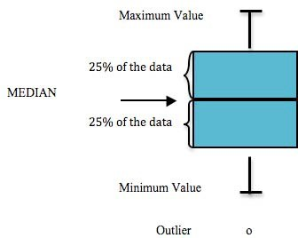

# Water Quality Parameters Results

## Interpreting Box Plots
Each of the following graphs display the sampling results for a specific parameter, such as arsenic. Within these graphs, a box and extending lines represent the results reported at each sampling site. A horizontal line within the box corresponds to the median of the data. The box contains 50% of the data and the vertical lines display the minimum and maximum values. Any data points that fall outside of the acceptable range are outliers and are portrayed as small circles (@fig-boxplot1).

{#fig-boxplot1}


<br>

```{r echo = F, message = F}

## initialization
# clear environment
rm(list=ls())

# load packages
library(tidyverse)
library(lubridate)
library(readr)
library(readxl)
library(writexl)
library(hms)
library(plotly)
library(DT)
library(xlsx)
library(leaflet)
library(DT)
library(ggpubr)
library(plotrix)
library(remotes)
install_github("USGS-R/EGRET")

select <- dplyr::select

# set plotting themes

## geom_col plots theme
col_theme <- theme(axis.title = element_text(size = 14, face = "bold"),
                   strip.text = element_text(size = 14, face = "bold"),
                   legend.title = element_text(size = 14, face = "bold"),
                   legend.text = element_text(size = 14),
                   axis.text = element_text(size = 14))

## geom_points plots theme
points_theme <- theme(axis.title = element_text(size = 14, face = "bold"),
                   strip.text = element_text(size = 14, face = "bold"),
                   legend.title = element_text(size = 14, face = "bold"),
                   legend.text = element_text(size = 14),
                   axis.text = element_text(size = 14),
                   title = element_text(size = 18))

# function to exclude multiple items per column
'%ni%' <- Negate('%in%')

```

```{r echo = F}

##### Notes on data sourcing

#Data is sourced from the following queries at <https://waterqualitydata.us> on Feb 24, 2021:

# CSV download for SAMPLE data: <https://www.waterqualitydata.us/portal/#bBox=-151.322501%2C60.274310%2C-149.216144%2C60.738915&mimeType=csv&dataProfile=narrowResult>

# CSV download for SAMPLE SITE data: <https://www.waterqualitydata.us/portal/#countrycode=US&statecode=US%3A02&countycode=US%3A02%3A122&bBox=-151.322501%2C60.274310%2C-149.216144%2C60.738915&mimeType=csv>

# Note: these CSV files are excluded from the GitHub repository because they are too large to sync. To reproduce the analysis, download and save these files locally instead. (See the ReadMe file at data/WQX_downloads in the repository).

# Using these same queries in the future will download the most current csv files that may have received additional data in the interim.

# We initially attempted to perform the task described above with the dataRetrieval package, but were not successful.

```

```{r echo = F}

# read in and prepare csv files downloaded from EPA WQX

```


```{r echo = F}

# steps
## intake all existing WQX data with EGReT (?)
## recreate 2000 - 2014 figures
### get csv of adec drinking water standards

```


```{r echo = F}

# readNWIS won't read the site IDs I try so far ....

library(dataRetrieval)
# Choptank River near Greensboro, MD
siteNumber <- "10000022"

ChoptankInfo <- readNWISsite(siteNumber)
parameterCd <- "00060"

# Raw daily data:
rawDailyData <- readNWISdv(
  siteNumber, parameterCd,
  "1980-01-01", "2010-01-01"
)

# Sample data Nitrate:
parameterCd <- "00618"
qwData <- readNWISqw(
  siteNumber, parameterCd,
  "1980-01-01", "2010-01-01"
)

pCode <- readNWISpCode(parameterCd)

# determine site IDs
# determine parameter IDs
10000173


```


\newpage
