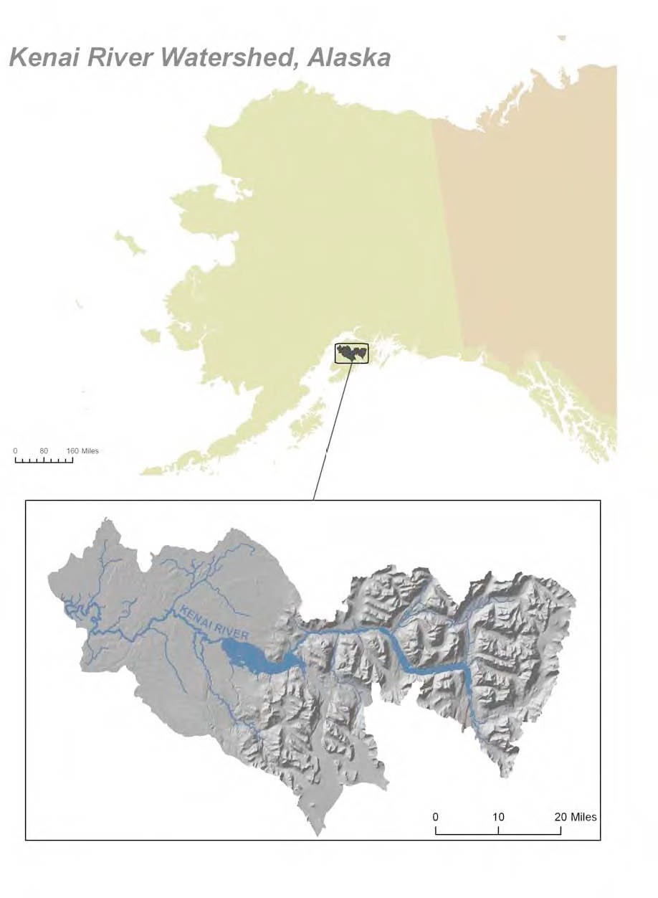
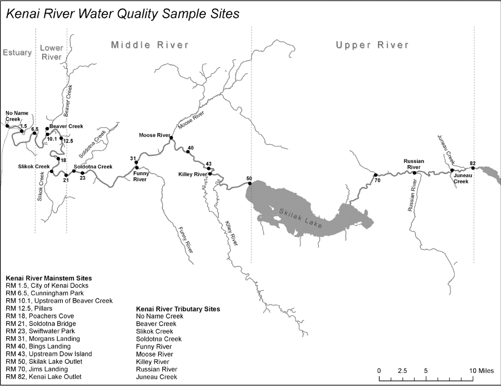

# Study Area

## Description

Located in southcentral Alaska, the Kenai River is part of the Cook Inlet Basin and is linked to the surrounding communities through sport and commercial fishing, tourism, recreation, and the propagation of fish and wildlife (see Figure 1). Five species of Pacific salmon flourish in the Kenai River Watershed, comprising 30% of the commercial Chinook harvest and 40% of the commercial sockeye harvest (Glass, 1999). Surface runoff, groundwater composition, natural minerals, aquatic plants and animals, and human activities can affect water quality in this area (Glass, 1999). Potential sources of pollution from humans include gasoline powered boat engines, agriculture, mining, street runoff, and perforated septic tanks.

[Update descriptions and references to more current]

## Figures/maps

```{r echo = F}

```

<br>

```{r echo = F}


# might need to rotate this 90 degrees?
```


## Sampling sites descriptions/photos

### Tributary Sites

### Main Stem Sites

\newpage
