# Study Area

## Description

Located in southcentral Alaska, the Kenai River is part of the Cook Inlet Basin and is linked to the surrounding communities through sport, commercial, personal use, and susbsistence fishing; as well as tourism, and recreation (@fig-map1). At least twenty-seven fish species, including six species of anadromous Pacific salmonids flourish in the Kenai River watershed, with sockeye (red) and Chinook (king) salmon as the primary species of interest for harvest and sport fisheries [@schoen2017; @willette2004]. The Kenai River his historically produced 80% of the sockeye harvested in Cook Inlet [@dorava2000].

Surface runoff, groundwater composition, natural minerals, aquatic plants and animals, and human activities can affect water quality in this area. Potential sources of pollution from humans include gasoline powered boat engines, agriculture, mining, street runoff, and perforated septic tanks [@glassrl1999; @reeves2018; @epa2011].

## Figures/maps

### Online Map of Sample Sites

Access ArcGIS Online project map at <https://arcg.is/0LXGSf>

{#fig-map1}

 

{#fig-map2}

## Sampling Site Descriptions

Field sampling sites shown in @fig-map2 are described below with coordinates, collection notes, and a representative photo. Site descriptions and photos are reproduced from the 2016 Kenai Watershed Forum Baseline Water Quality Assessment report; photos may be updated in future revisions of this report.

### Kenai River Mainstem Sites

#### Kenai River Mile 82

This site is near the Kenai Lake Outlet and Kenai Lake Bridge and is located at 60.492007 N and -149.810844 W. Samples are typically collected downstream of the boat launch.

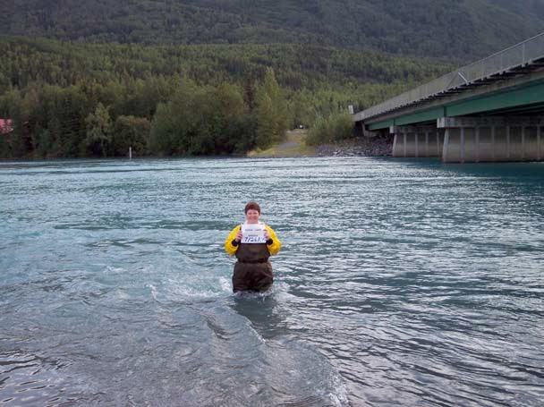{#fig-rm82}

#### Kenai River Mile 70

This site is near Jim's Landing and is located at 60.481392 N and -150.115020 W. The sample is typically collected 40 feet downstream of the boat launch.

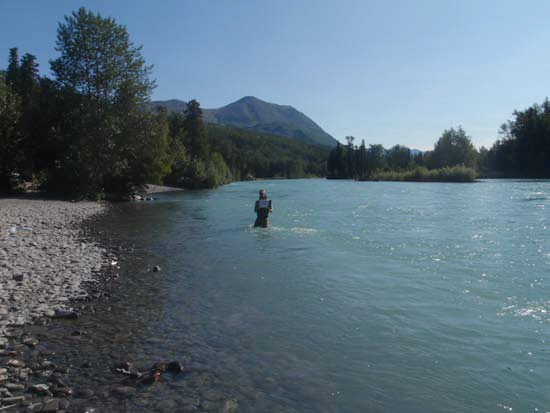{#fig-rm70}

#### Kenai River Mile 50

This site is near the Skilak Lake Outflow and is located at 60.467517 N and -150.507789 W. Samples are typically collected between the swan signs off of the south bank.

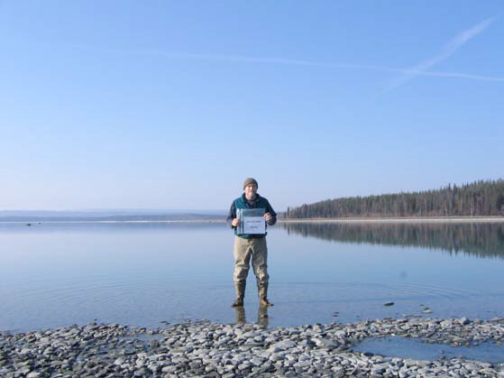{#fig-rm50}

#### Kenai River Mile 43

This site is upstream of Dow Island and is located at 60.489844 N and -150.636905 W. The samples are typically collected 100 feet upstream of the point of Dow Island.

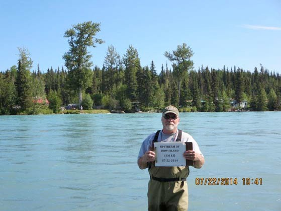{#fig-rm43}

#### Kenai River Mile 40

This site is near Bings Landing and is located at 60.515441 N and -150.702069 W. Samples are typically collected in front of the boat launch near the center of the river.

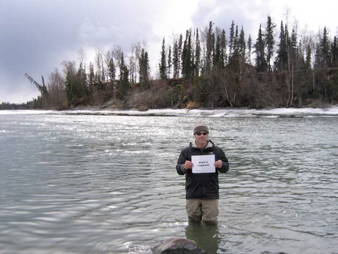{#fig-rm40}

#### Kenai River Mile 31

This site is near Morgan's Landing and is located at 60.498284 N and -150.863121 W. Sampling typically occurs down the abandoned steep road behind the headquarters building.

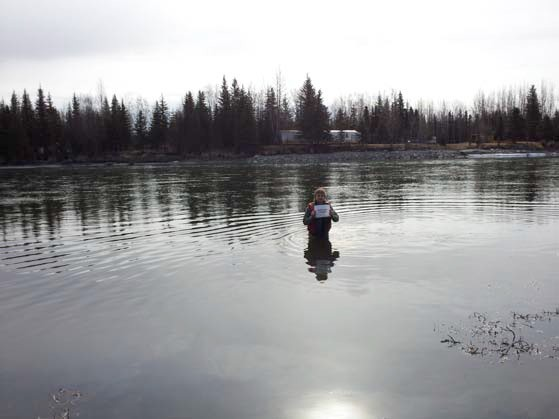{#fig-rm31}

#### Kenai River Mile 23

This site is near Swiftwater Park and is located at 60.480338 N and -151.030847 W. Samples are typically collected mid-channel in front of the ramp.

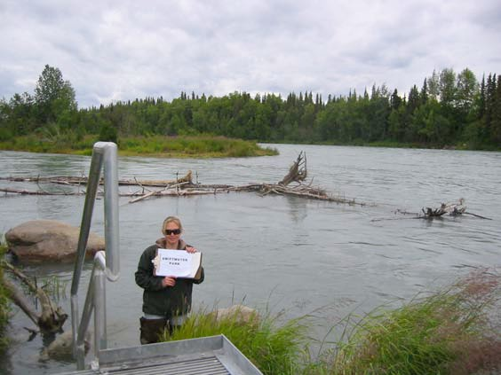{#fig-rm23}

#### Kenai River Mile 21

This site is near the Soldotna Bridge and is located at 60.476634 N and -151.082099 W. Samples are typically collected 20 feet downstream of the bridge on the south bank.

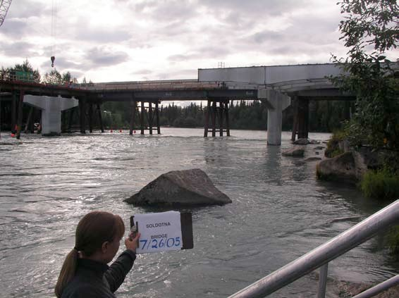{#fig-rm21}

#### Kenai River Mile 18

This site is near Poacher's Cove and is located at 60.502005 N and -151.106973 W. Samples are typically collected mid-channel just downstream of an island.

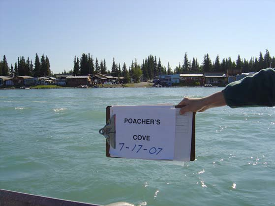{#fig-rm18}

#### Kenai River Mile 12.5

This site is near the Pillars Boat Launch and is located at 60.533743 N and -151.099258 W. Samples are typically collected toward the center of the river across from the dock.

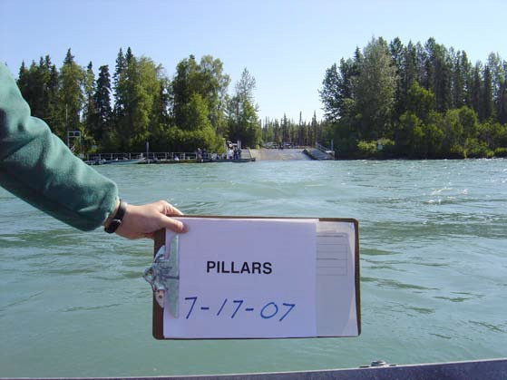{#fig-rm125}

#### Kenai River Mile 10.1

This site is upstream of Beaver Creek and is located at 60.539279 N and -151.142263 W. Samples are typically collected 200 yards upstream of the Beaver Creek and Kenai River confluence. During July 2000, April 2001, and July 2001, samples were collected downstream of the Kenai River and Beaver Creek confluence. No samples were collected from this site from several spring sampling events due to challenging access terrain.

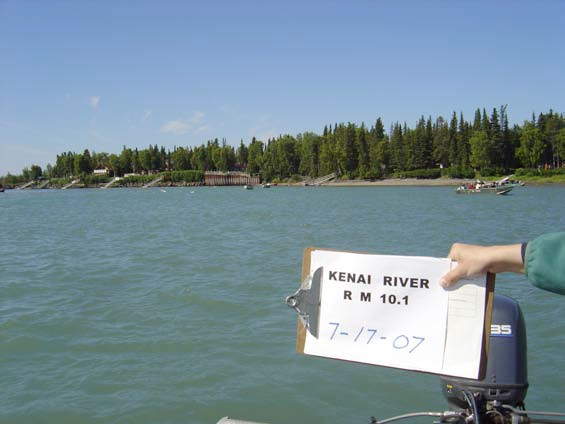{#fig-rm101}

#### Kenai River Mile 6.5

This site is near Cunningham Park and is located at 60.540810 N and -151.182780 W. Sampling typically occurs straight out from the public-use boardwalk and can vary due to tidal stage.

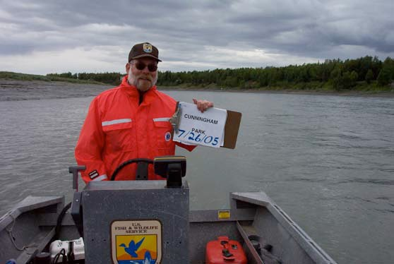{#fig-rm65}

#### Kenai River Mile 1.5

This site is near the City of Kenai Dock and is located at 60.543680 N and -151.222940 W. Samples are typically collected at the north end of the public fueling dock.

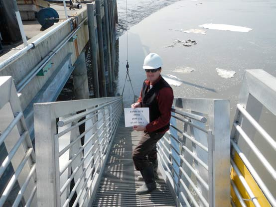{#fig-rm15}

### Tributary Sites

#### Juneau Creek

This site is located at 60.481392 N and -150.115020 W. The sample is typically collected 40 feet downstream of the boat launch at Alaska Wildlands.

{#fig-juneau}

#### Russian River

This site is a Kenai River tributary and is located at 60.484622 N and -149.993955 W. Samples are typically collected 90 feet upstream of the sanctuary sign.

{#fig-russian}

#### Killey River

This site is a Kenai River tributary and is located at 60.481518 N and -150.632498 W. Sampling typically occurs 100 yards upstream from the Kenai River confluence across from the fish table.

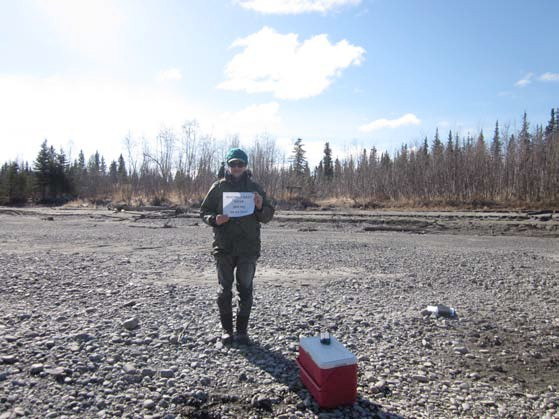{#fig-killey}

#### Moose River

This site is a Kenai River tributary and is located at 60.536870 N and -150.754724 W. Sampling typically occurs upstream of the parking area.

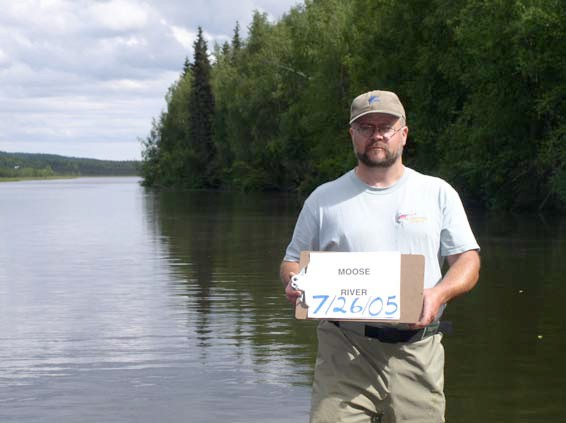{#fig-moose}

#### Funny River

This site is a Kenai River tributary and is located at 60.489963 N and -150.860982 W. Samples are typically collected 75 feet downstream of the bridge.

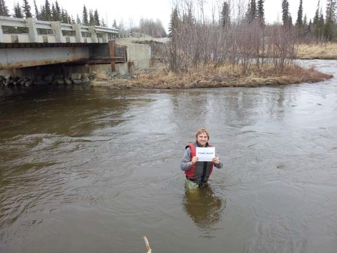{#fig-funny}

#### Soldotna Creek

This site is a Kenai River tributary and is located at 60.483364 N and -151.057656 W. Sampling typically occurs mid-channel.

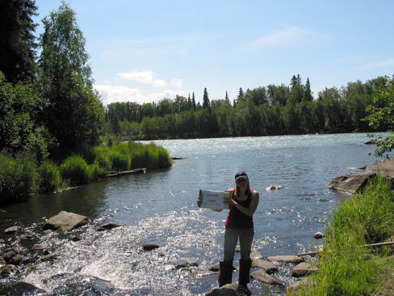{#fig-soldotna}

#### Slikok Creek

This site is a Kenai River tributary and is located at 60.482318 N and -151.127053 W. Samples are typically collected in the mid-channel of Slikok Creek.

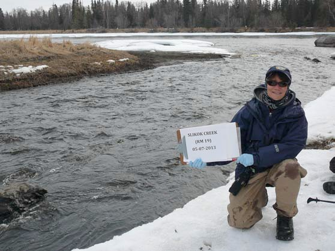{#fig-slikok}

#### Beaver Creek

This site is a Kenai River tributary and is located at 60.548029 N and -151.143240 W.

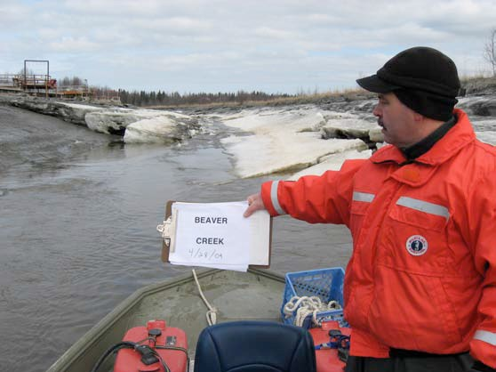{#fig-beaver}

#### No Name Creek

This site is a Kenai River tributary located at 60.550888 N and -151.268417 W. Samples are typically collected approximately 500 feet upstream of the confluence with the Kenai River, just upstream of the footbridge.

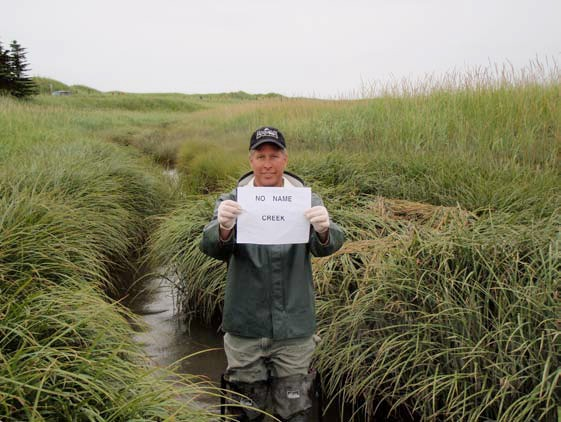{#fig-noname}

\newpage
